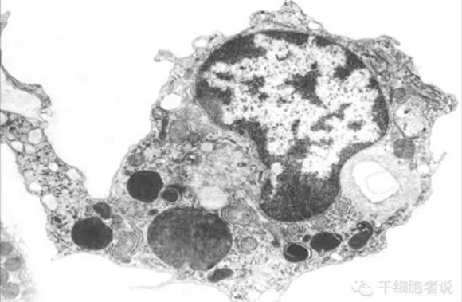

<!DOCTYPE html>
<html lang="zh-CN">
<head>
    <meta charset="UTF-8">
    <meta name="viewport" content="width=device-width, initial-scale=1.0">
    <title>巨噬细胞科普 - 免疫系统的守护者</title>
    <link rel="stylesheet" href="https://cdnjs.cloudflare.com/ajax/libs/font-awesome/6.4.0/css/all.min.css">
    
</head>
<body>
    <!-- 背景Canvas - 最外层，20%透明度 -->
    <canvas id="backgroundCanvas"></canvas>

    

        <!-- 左侧导航栏 -->
        

            

                <h1>巨噬细胞科普</h1>
                
免疫系统的守护者

            

            <ul class="nav-links">
                <li><a href="#intro" class="nav-link active" data-section="intro"><i class="fas fa-info-circle"></i> 简介</a></li>
                <li><a href="#functions" class="nav-link" data-section="functions"><i class="fas fa-cogs"></i> 功能</a></li>
                <li><a href="#videos" class="nav-link" data-section="videos"><i class="fas fa-video"></i> 科普视频</a></li>
                <li><a href="#research" class="nav-link" data-section="research"><i class="fas fa-flask"></i> 学术前沿</a></li>
                <li><a href="#game" class="nav-link" data-section="game"><i class="fas fa-gamepad"></i> 游戏体验</a></li>
            </ul>
        

        <!-- 主内容区域 -->
        

            <!-- 简介部分 -->
            <section id="intro" class="content-section active">
                <h2>巨噬细胞简介</h2>
                

                    

                        
巨噬细胞（macrophage cell）也称组织细胞（histocyte），是由血液中的单核细胞穿出血管后分化而成的。单核细胞进入结缔组织后，体积增大，内质网和线粒体增生，溶酶体增多，吞噬功能增强。

                        
巨噬细胞的寿命因所在组织器官而异，一般可存活数月或更长。它们广泛分布于全身各处，是先天免疫系统的重要组成部分。

                        <h3>分化过程中的表型改变</h3>
                        
单核细胞向巨噬细胞分化的过程中伴随显著的表型改变：

                        <ul>
                            <li>细胞表面受体如补体iC3b和转铁蛋白的受体表达增加</li>
                            <li>细胞内酶如α-氨基己糖苷酯酶、肌酸激酶、组织谷氨酰胺转移酶和cAMP依赖的蛋白激酶表达增强</li>
                            <li>分泌过氧化氢和超氧离子的能力降低</li>
                        </ul>
                        
此过程还明显受IFN-γ和激素的负调节。

                    

                    

                        
                    

                

            </section>

            <!-- 功能部分 -->
            <section id="functions" class="content-section">
                <h2>巨噬细胞的主要功能</h2>
                

                    

                        

                            <i class="fas fa-utensils"></i>
                        

                        <h3>吞噬作用</h3>
                        
巨噬细胞能够识别并吞噬病原体、凋亡细胞和细胞碎片，是机体清除异物的主要细胞。

                    

                    

                        

                            <i class="fas fa-bell"></i>
                        

                        <h3>抗原呈递</h3>
                        
作为抗原呈递细胞，巨噬细胞处理抗原并将其呈递给T细胞，启动适应性免疫应答。

                    

                    

                        

                            <i class="fas fa-seedling"></i>
                        

                        <h3>组织修复</h3>
                        
巨噬细胞分泌生长因子和细胞因子，促进组织修复和血管生成。

                    

                    

                        

                            <i class="fas fa-balance-scale"></i>
                        

                        <h3>免疫调节</h3>
                        
通过分泌各种细胞因子，巨噬细胞调节免疫反应的强度和持续时间。

                    

                

            </section>

            <!-- 科普视频部分 -->
            <section id="videos" class="content-section">
                <h2>科普视频</h2>
                
以下是与巨噬细胞相关的科普视频，帮助您更直观地理解其功能和作用机制。

                

                    

                        

                            <video controls poster="picture/video1-poster.jpg">
                                <source src="video1.mp4" type="video/mp4">
                                您的浏览器不支持视频播放。
                            </video>
                        

                        

                            <h3 class="video-title">巨噬细胞吞噬过程演示</h3>
                            
本视频展示了巨噬细胞如何识别并吞噬病原体的过程，包括趋化、识别、吞噬和消化等关键步骤。

                        

                    

                    

                        

                            <video controls poster="picture/video2-poster.jpg">
                                <source src="video2.mp4" type="video/mp4">
                                您的浏览器不支持视频播放。
                            </video>
                        

                        

                            <h3 class="video-title">巨噬细胞在免疫系统中的作用</h3>
                            
本视频详细解释了巨噬细胞在先天免疫和适应性免疫中的关键作用，以及与其他免疫细胞的协同工作。

                        

                    

                

            </section>

            <!-- 学术前沿部分 -->
            <section id="research" class="content-section">
                <h2>学术前沿</h2>
                
以下是最新关于巨噬细胞的重要研究进展：

                

                    

                        

                            <h3 class="article-title">Single-cell compendium of muscle microenvironment in peripheral artery disease reveals altered endothelial diversity and LYVE1 macrophage activation</h3>
                            
Nature Cardiovascular Research (2025)

                        

                        

                            
Guillermo Turiel, Thibaut Desgeorges, Evi Masschelein, Zheng Fan, David Lussi, Christophe M. Capelle, Giulia Bernardini, Raphaela Ardicoglu, Katharina Schönberger, Manuela Birrer, Sandro F. Fucentese, Jing Zhang, Daniela Latorre, Stephan Engelberger & Katrien De Bock

                            
本研究通过单细胞技术分析了外周动脉疾病中肌肉微环境的变化，发现了内皮细胞多样性的改变和LYVE1巨噬细胞的激活。

                            

                                <i class="fas fa-eye"></i> 1956 Accesses
                                <i class="fas fa-chart-bar"></i> 12 Altmetric
                            

                        

                    

                    

                        

                            <h3 class="article-title">Macrophage ferroptosis potentiates GCN2 deficiency induced pulmonary venous arterialization</h3>
                            
Nature Communications volume 16, Article number: 8335 (2025)

                        

                        

                            
Jingyuan Zhang, Pei Mao, Tengfei Zhou, Bingqing Yue, Yaning Li, Yuanhua Qiu, Kejing Ying, Fudi Wang, Jingyu Chen & Jun Yang

                            
本研究探讨了巨噬细胞铁死亡在GCN2缺陷诱导的肺静脉动脉化中的作用，揭示了新的治疗靶点。

                            

                                <i class="fas fa-eye"></i> 2017 Accesses
                                <i class="fas fa-chart-bar"></i> 18 Altmetric
                            

                        

                    

                    

                        

                            <h3 class="article-title">Macrophage-derived amphiregulin induces myofibroblast transition in adipogenic lineage precursors near Staphylococcus aureus abscess in bone marrow</h3>
                            
Nature Communications volume 16, Article number: 8409 (2025)

                        

                        

                            
Bingsheng Yang, Jianwen Su, Jichang Wu, Zhongwen Wang, Jin Hu, Mankai Yang, Yihuang Lin, Mingchao Jin, Xiaochun Bai, Bin Yu & Xianrong Zhang

                            
本研究发现在金黄色葡萄球菌脓肿附近的骨髓中，巨噬细胞来源的双调蛋白诱导脂肪谱系前体细胞向肌成纤维细胞转变。

                            

                                <i class="fas fa-eye"></i> 307 Accesses
                                <i class="fas fa-chart-bar"></i> 25 Altmetric
                            

                        

                    

                

            </section>

            <!-- 游戏部分 -->
            <section id="game" class="content-section">
                <h2>游戏体验：巨噬细胞吞噬病毒</h2>
                
通过互动游戏体验巨噬细胞的工作方式！控制巨噬细胞吞噬病原体，但小心不要伤害正常细胞。

                

                    

                        
分数: 0/100

                        
时间: 0s

                        
巨噬细胞: 1

                    

                    <canvas id="gameCanvas" width="800" height="500"></canvas>

                    

                        <h2 id="gameOverText">游戏结束</h2>
                        
你的分数: 0

                        <button id="restartButton" class="btn">重新开始</button>
                    

                

                

                    <h3>游戏说明:</h3>
                    
控制巨噬细胞(蓝色)移动吞噬病毒(红色)和感染细胞(紫色)，每吞噬一个得5分。

                    
注意：不要吞噬正常细胞(绿色)，否则游戏结束！

                    
感染细胞每20秒会破裂变成3个病毒。达到100分获胜！

                    
使用鼠标移动控制巨噬细胞。

                

                

                    

                        

                        巨噬细胞 (玩家)
                    

                    

                        

                        病毒 (敌人)
                    

                    

                        

                        感染细胞 (敌人)
                    

                    

                        

                        正常细胞 (中立)
                    

                

            </section>
        

    

    
</body>
</html>
